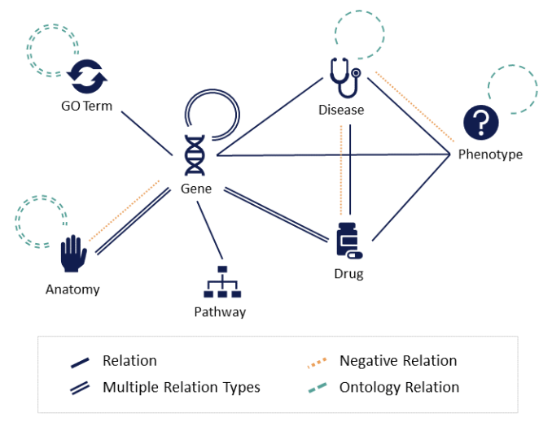

.. OpenBioLink documentation master file, created by
   sphinx-quickstart on Fri Feb 12 12:57:25 2021.
   You can adapt this file completely to your liking, but it should at least
   contain the root `toctree` directive.

OpenBioLink
=======================================

OpenBioLink is a resource and evaluation framework for evaluating link prediction models on heterogeneous biomedical graph data. It contains benchmark datasets as well as tools for creating custom benchmarks and training and evaluating models.

`Paper preprint on arXiv <https://arxiv.org/abs/1912.04616>`__

`Peer reviewed version in the journal Bioinformatics (for citations) <https://doi.org/10.1093/bioinformatics/btaa274>`__

`Supplementary data <https://github.com/OpenBioLink/OpenBioLink/raw/master/paper/supplementary%20data.pdf>`__

The OpenBioLink benchmark aims to meet the following criteria:

*   Openly available
*   Large-scale
*   Wide coverage of current biomedical knowledge and entity types
*   Standardized, balanced train-test split
*   Open-source code for benchmark dataset generation 
*   Open-source code for evaluation (independent of model) 
*   Integrating and differentiating multiple types of biological entities and relations (i.e., formalized as a heterogeneous graph)
*   Minimized information leakage between train and test sets (e.g., avoid inclusion of trivially inferable relations in the test set)
*   Coverage of true negative relations, where available
*   Differentiating high-quality data from noisy, low-quality data
*   Differentiating benchmarks for directed and undirected graphs in order to be applicable to a wide variety of link prediction methods
*   Clearly defined release cycle with versions of the benchmark and public leaderboard

.. toctree::
   :caption: Getting Started
   :name: quickstart
   :maxdepth: 2

   installation
   tutorial/graph_generation
   tutorial/dataset_split
   tutorial/evaluation
   sources
   
.. toctree::
   :caption: Benchmark datasets
   :name: benchmark
   :maxdepth: 2

   openbiolink_2020
   
.. toctree::
   :caption: Reference
   :name: reference
   :maxdepth: 2

   reference/dataloader
   reference/evaluator

Indices and tables
==================

* :ref:`genindex`
* :ref:`modindex`
* :ref:`search`
